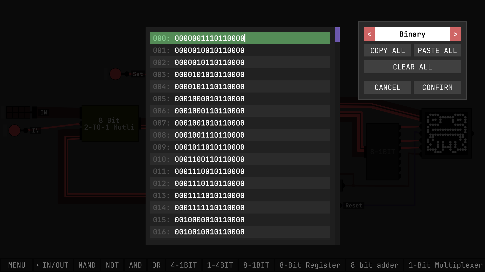
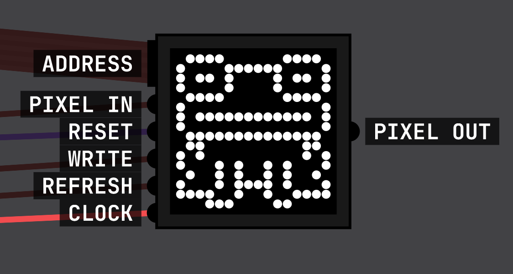
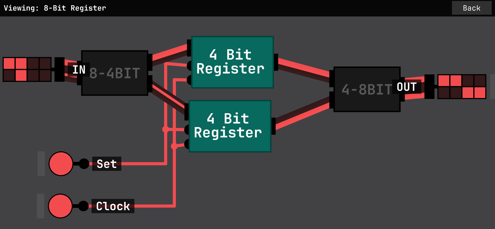
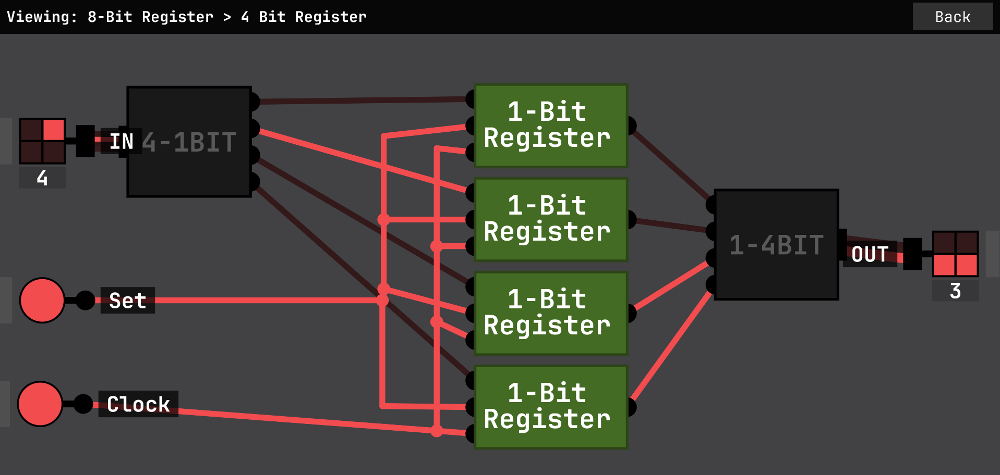
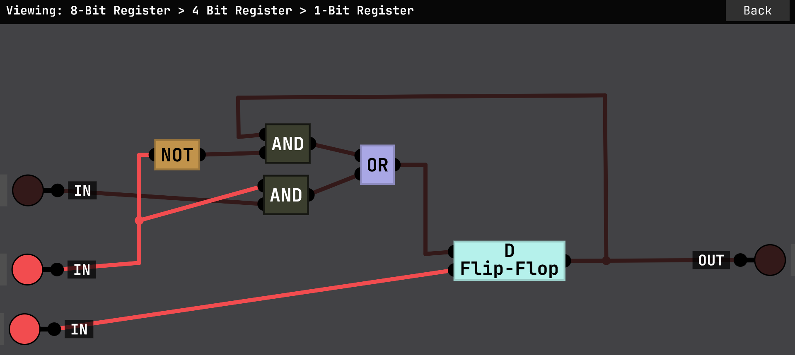
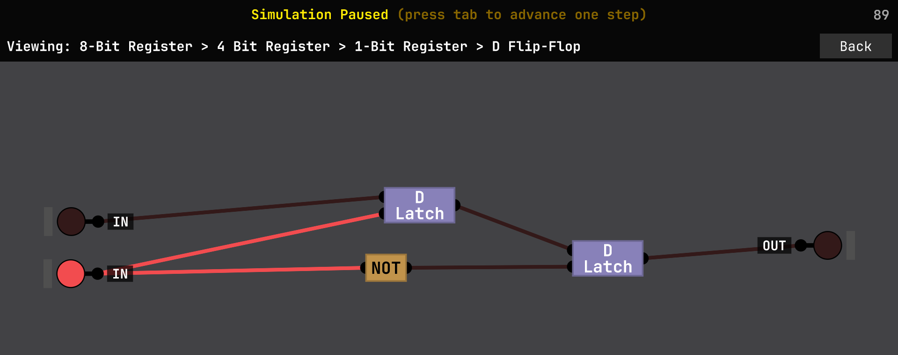
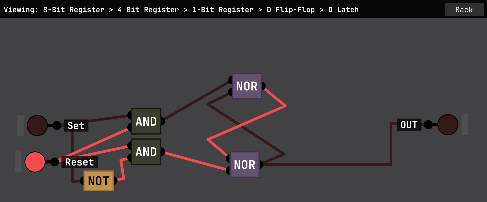
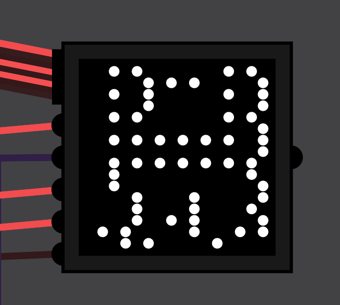
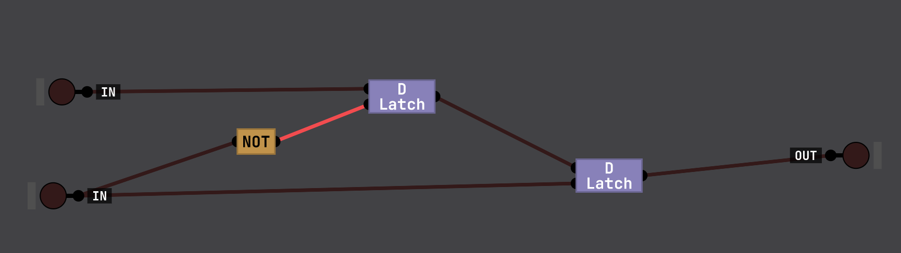
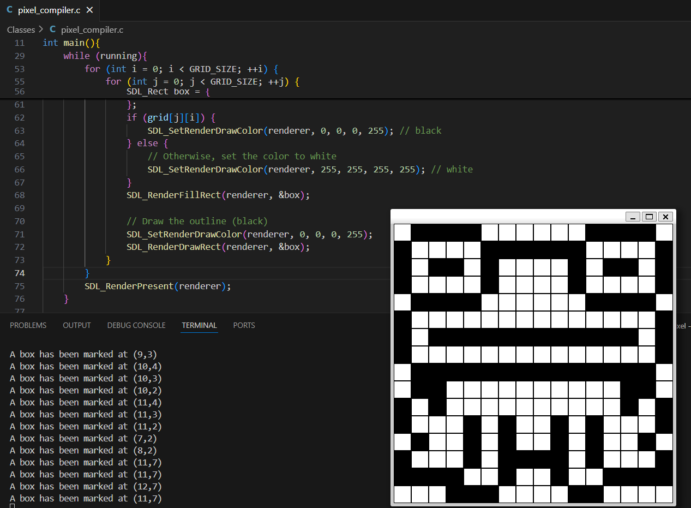

# Rom-Pixel-Display
Using [Sebastian Lague's Digital Logic Sim](https://github.com/SebLague/Digital-Logic-Sim) and a compiler I programed in C, I'm able to display a 16x16 pixel pattern on his simulator using binary machine instructions.
  
The open canvas of the simulator allowed me to freely experiment and test with any setup I wanted to work with after watching some explanatory videos.
  
The main focus of this project was the display screen and the ROM chip (labeled in blue as "ROM 256x16").
 

  

Everything to the left of the ROM chip is a binary counter. This counter acts as a ROM iterator, incrementing the instruction line by one each cycle. The component labeled "8 Bit 2-to-1 Multi" is a multiplexer that lets me troubleshoot or reset the counter. When I set its control input to zero, it continuously feeds the value 0 into the loop. This effectively halts the ROM chip from running its program.

# ROM
The developer of the simulator added a built-in 256 × 16-bit ROM chip in his April 2025 update. This chip inspired the project and accepts binary input, which can be sent to any connected chip. 
  
In his latest video, Sebastian Lague builds a similar 256 × 16-bit ROM entirely out of logic gates. However, this project focuses on using the computer’s clipboard to copy and paste binary code directly. 
 

  
  

After manual testing, I found that the pixel display addresses run left to right, bottom to top. This means the address of the bottom-left pixel is 00000000, and the address of the top-right pixel is 11111111.
 
 
The 16-bit binary code is structured as follows: AAAAAAAA MMMM XXXX. The leftmost 8 bits (A) represent the address of the display, the next 4 bits (M) are used for opcode instructions, and the final 4 bits (X) are unused.

# Modularity and Troubleshooting
This is an example of how the 8 bit register chip is built from pre existing chips. This cycle of modularity repeats until it reaches the lowest level of logic gate in the software(NAND).
 

  
  
  
  
  

 
However, a key problem arose when testing the full assembly after connecting all the modules and chips. Depending on when I'd saved and restarted the application, the output on the display would skip every other instruction, or worse, skip four instructions at a time. This made the output miss a significant portion of the display it was supposed to print out as seen below.
 
 

This was my first roadblock in the project, as I had no insight on where the bug was located. The issue would have stemmed from my program, the simulator, the assembly or all of the above.
  
After rigorous testing, pausing the clock to iterate it tick by tick, and searching through all the module and chip layouts. I noticed that the ROM iterator that I built to add the number 1 to a register repeatedly, was executing the register on a rising edge due to the layout of the D Flip-Flop. Unfortunately the built-in display module executed it's pixel in, write, refresh and address inputs on a rising edge as well.
  
Due to the almost instantaneous action of the rising edge, the ROM iterator would update and increase the iteration by 1 before the display module could intake the ROMs outputs and also refresh the display screen.
  
Now that I knew that the ROM iterator and the display had to be on out-of-phase clocks, I turned to the design of the ROM iterator.
  

  
When focused on the register chip, the D Flip-Flop updated on the rising edge(image shown above)
  
I then changed it to update on the opposite set value by connecting the NOT gate to the second D-Latch, essentially creating a D Flip-Flop that sets its data on a falling edge(image shown above)
  

  
# Custom Compiler
So the bulk of the project was utlizing the SDL2 library with C to create an interface of a 16x16 pixel grid so I could display the image in the simulator. The pop up window allows for blocks to be turned on and off when pressed, the bottom left of the window is (0,0) and the top right is (15,15). 
 

Once the window is closed all blocks that are marked are saved in an array in numerical order of the coordinate system. Once printed in the simulator, due to the array saving order, the display is printed from left to right, and bottom to top of the display.
 

# Improvements

In future iterations, this project can be significantly improved. One potential enhancement is revising the binary instruction format to follow a more standardized convention, such as placing the address on the right side of the 16-bit sequence. 
  
The primary reason C was initially chosen was due to familiarity with its syntax and the language as a whole. However, future development will adopt an object-oriented programming language like C++, to take advantage of improved structure, modularity, and scalability.

