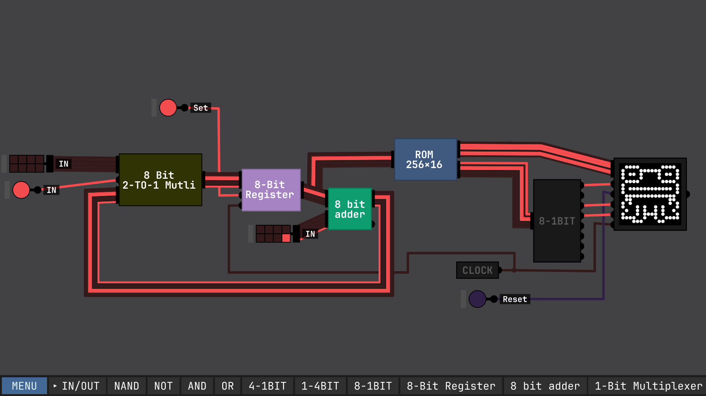

# Rom-Pixel-Display
Using [Sebastian Lague's Digital Logic Sim](https://github.com/SebLague/Digital-Logic-Sim) and a compiler I programed in C, I'm able to display a 16x16 pixel pattern on his program with binary machine instructions.
  
The open canvas of the simulator allowed me to freely experiment and test with any set up I wanted to work with after watching the explanatory videos that the developer has been posting on his youtube channel.
 
The main focus of this project was the display screen and the ROM chip (labeled in blue as "ROM 256x16").
 

  

Everything to the left of the ROM chip, although visually complex, is a binary counter that allows for the ROM chip to increment each instruction by 1 line. The multiplexer labeled, "8 Bit 2-to-1 Multi" allows me to troubleshoot/reset the counter anytime I turn off its set input to zero, allowing for the integer 0 to be continuously inputted in the loop, effectively halting the ROM chip from executing its program.

# ROM
The developer of the simulator provided a built-in 256 Bit ROM chip in his latest update as of May 2025. This chip is what inspired me to make this project and allows binary input that can output to any chip as needed. 
 
In Sebastian Lague's most recent video he assembles this same 256 bit ROM module but strictly with logic gates. However, this project focuses on the ability to copy and paste binary code from the computer's clipboard.
 

  
  

After manual testing, I found that the pixel display addresses run left to right, bottom to top, so the binary code.

# Modularity and Troubleshooting
This is an example of how the 8 bit register chip is built from pre existing chips. This cycle of modularity repeats until it reaches the lowest level of logic gate in the software(NAND).
 

  
  
  
  
  

 
However, a key problem arose when testing the full assembly after connecting all the modules and chips together.

# Custom Compiler
So the bulk of the project was utlizing the SDL2 library with C to create an interface of a 16x16 pixel grid so I could display the image in the simulator. The pop up window allows for

 

